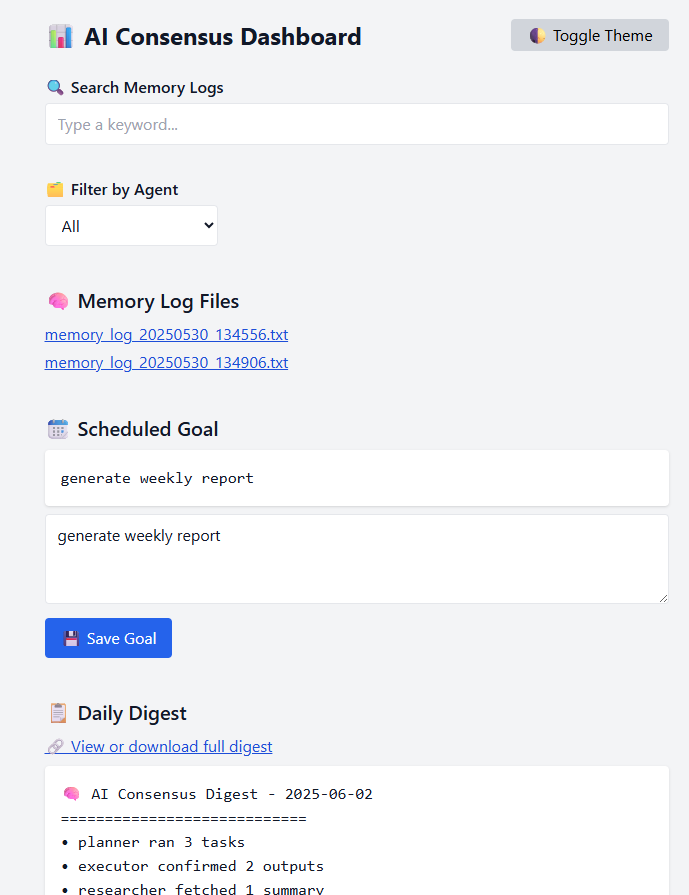

# 🤖 AI Consensus System (Personal Build)

This is a **private** AI automation and dashboard system designed for personal use. It integrates autonomous agent control, daily execution logic, memory tracking, insights generation, and a real-time dashboard UI.

---

## 🔍 Features

- ✅ Manual + Scheduled Agent Execution
- ✅ Editable Daily Goal + Digest Generator
- ✅ Email Delivery via Gmail App Passwords
- ✅ Keyword Search + Agent Filter on Logs
- ✅ Daily Log Insights Summary
- ✅ Downloadable ZIPs for Logs and Memory
- ✅ Mobile Responsive Design
- ✅ 🌓 Dark Mode Toggle (saved to browser)

---

## 📸 Screenshots

*(Save screenshots in `/docs/screenshots/` and update links below)*

```



```

---

## 📦 File Structure

```plaintext
consensus-project/
├── agents/              # Logic modules (digest, email, insights, backup)
├── consensus/           # Scheduler, main loop, memory viewer
├── memory/              # Agent memory logs
├── logs/                # Execution logs
├── web/                 # Frontend UI
├── backups/             # (Optional) Local ZIP backups
├── .env                 # Gmail email/password for digest delivery
├── dashboard.py         # Main server
├── scheduler.py         # Daily automation runner
├── README.md            # Original (preserved)
└── README_v1.1.md       # This version
```

---

## ⚙ Setup & Run

1. **Install dependencies**  
```bash
pip install python-dotenv schedule
```

2. **Set up your `.env` file**

```env
EMAIL_ADDRESS=youremail@gmail.com
EMAIL_PASSWORD=your_gmail_app_password
```

3. **Start the dashboard**

```bash
python dashboard.py
```

4. *(Optional)* Start the scheduler in a separate terminal:

```bash
python consensus/scheduler.py
```

---

## 🚀 Features in v1.1

- 🌗 Dark Mode Toggle
- 📱 Mobile View Support
- 📤 Email Delivery of Daily Digest
- 🧠 Log Insights Analyzer
- 🧰 “Run Agent Now” Button
- 📁 ZIP Export of Logs + Memory
- 📆 Auto-archiving Digest by Date
- 🕓 Auto-refresh every 60 seconds

---

**⚠ Private Use Only**  
This project is personal and secure. Not intended for public distribution or production hosting.

